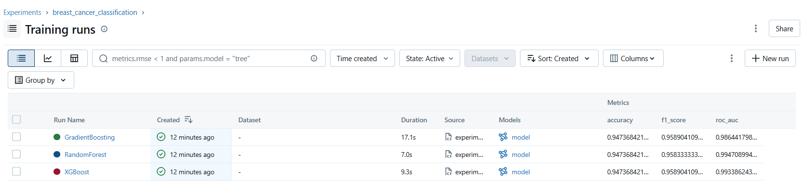
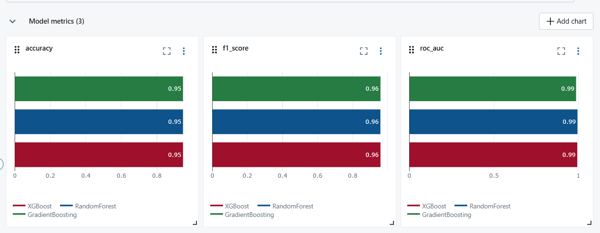
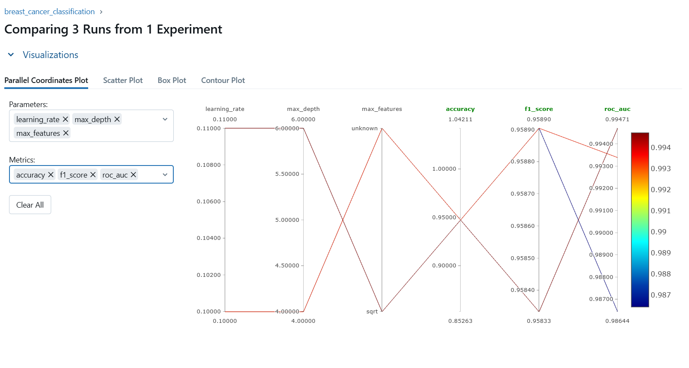
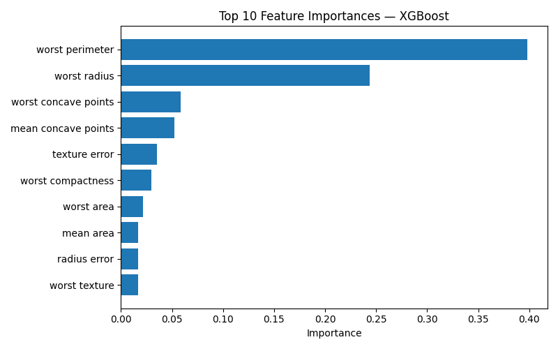
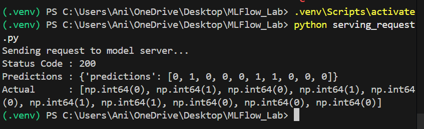

# MLflow Experiment Tracking — Breast Cancer Classification

This project demonstrates MLflow experiment tracking by training and comparing three classification models on the Breast Cancer Wisconsin dataset. It covers autologging, manual logging, model serving, and HTTP predictions.

---

## Project Structure

```
MLflow_Lab/
    experiment.py        # Train & compare 3 models, log to MLflow
    starter.py           # Intro to autologging and manual logging
    serving.py           # Find best model and serve it
    serving_request.py   # Send HTTP request to model server
    requirements.txt     # Dependencies
    screenshort/         # Output screenshots
```

---

## Dataset

**Breast Cancer Wisconsin** — built into scikit-learn, no download needed.
- 569 samples, 30 features
- Binary classification: malignant (0) vs benign (1)

---

## Models Compared

| Model | n_estimators | max_depth | learning_rate |
|---|---|---|---|
| XGBoost | 100 | 4 | 0.1 |
| Random Forest | 100 | 6 | - |
| Gradient Boosting | 100 | 4 | 0.1 |

**Metrics logged:** Accuracy, F1 Score, ROC-AUC
**Artifacts logged:** Top 10 feature importance plot per model

---

## Setup

```bash
# Create and activate virtual environment
python -m venv .venv
.venv\Scripts\activate

# Install dependencies
pip install -r requirements.txt
```

---

## How to Run

### 1. Autologging intro
```bash
python starter.py
```

### 2. Train all 3 models
```bash
python experiment.py
```

### 3. View results in MLflow UI
```bash
mlflow ui --port=5001
```
Open browser at: http://localhost:5001

### 4. Find best model and load it
```bash
python serving.py
```
Copy the serve command it prints at the end.

### 5. Start model server (in a separate terminal)
```bash
mlflow models serve --env-manager=local -m runs:/<run_id>/model -h 127.0.0.1 -p 5002
```

### 6. Send HTTP predictions (in original terminal)
```bash
python serving_request.py
```

---

## Results

### Training Runs — All 3 Models Logged


### Metrics Comparison — Accuracy, F1, AUC


### Parallel Coordinates Plot


### Feature Importance — Top 10 Features


### HTTP Predictions via Model Server


---

## Key Findings

All 3 models performed strongly on this dataset:
- **Best model by AUC: RandomForest (0.9947)**
- `worst radius` and `worst perimeter` are the most important features across all models
- All models achieve above 0.95 accuracy and 0.96 F1 score

---

## What This Project Demonstrates

- MLflow autologging with scikit-learn
- Manual parameter and metric logging
- Feature importance plot logging as MLflow artifact
- Comparing multiple runs in MLflow UI
- Loading a logged model and making predictions
- Serving a model via HTTP using `mlflow models serve`
- Sending predictions via REST API using `requests`